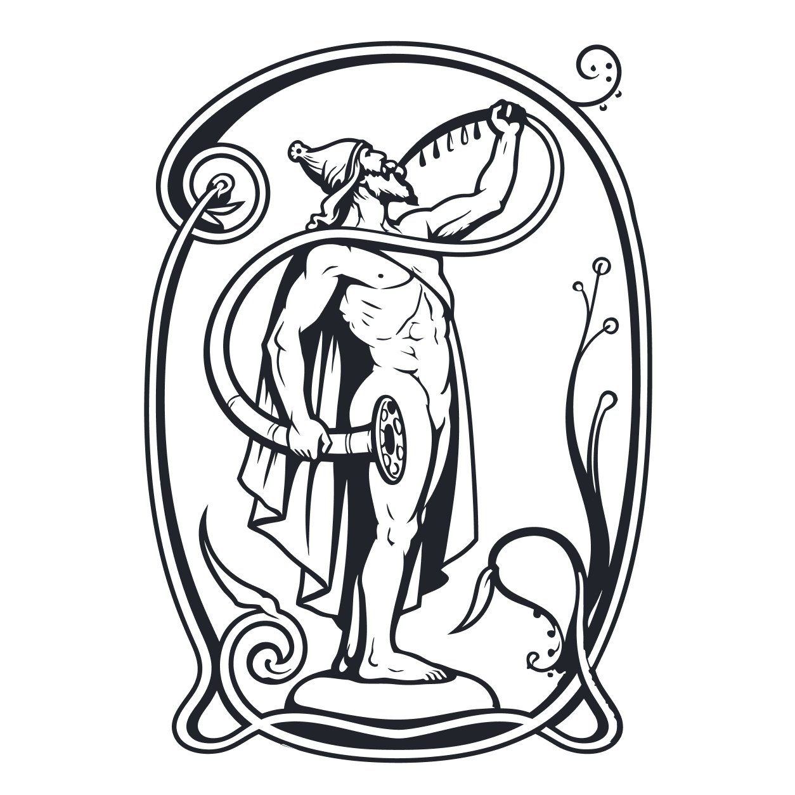
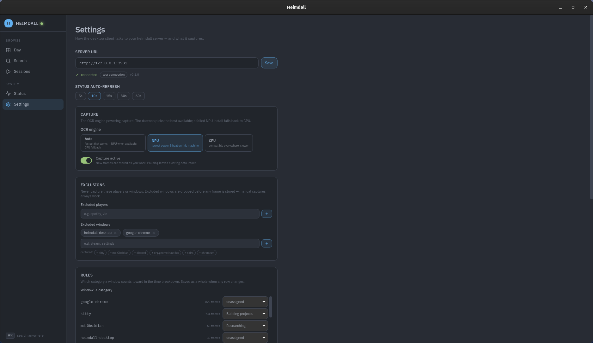
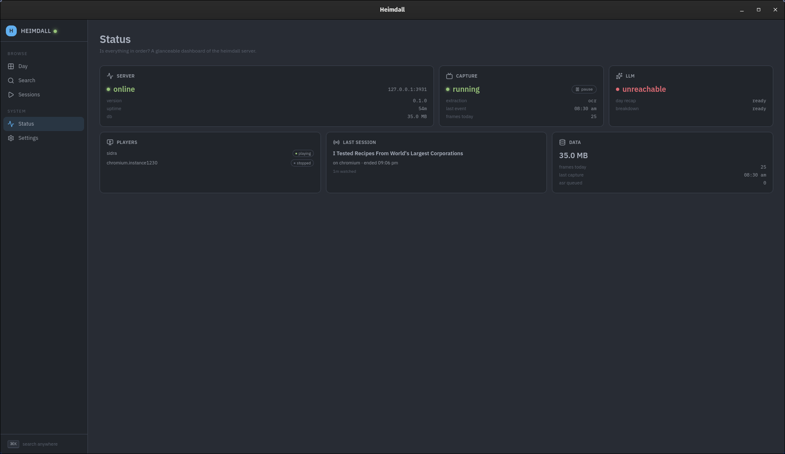
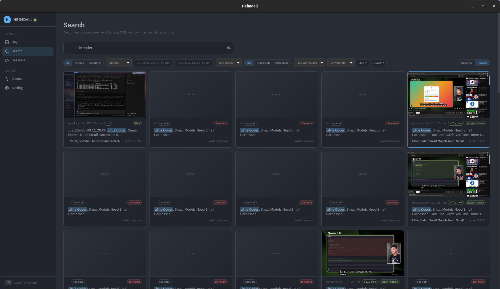
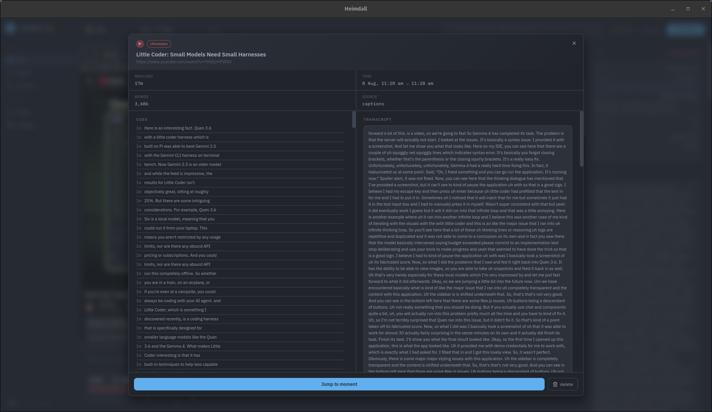
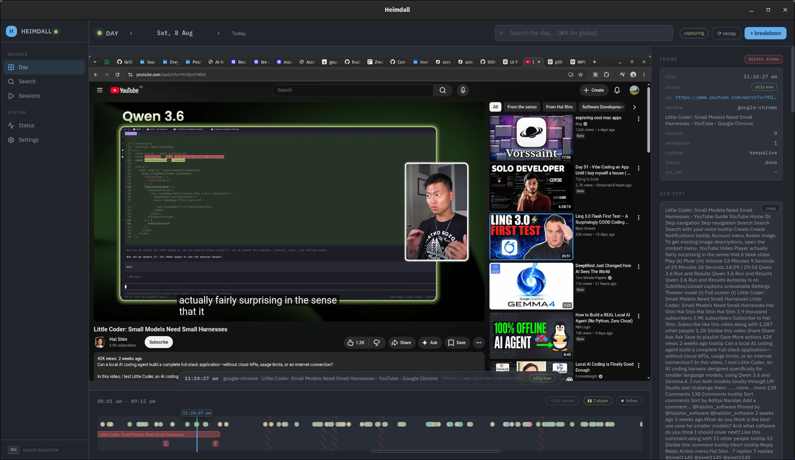
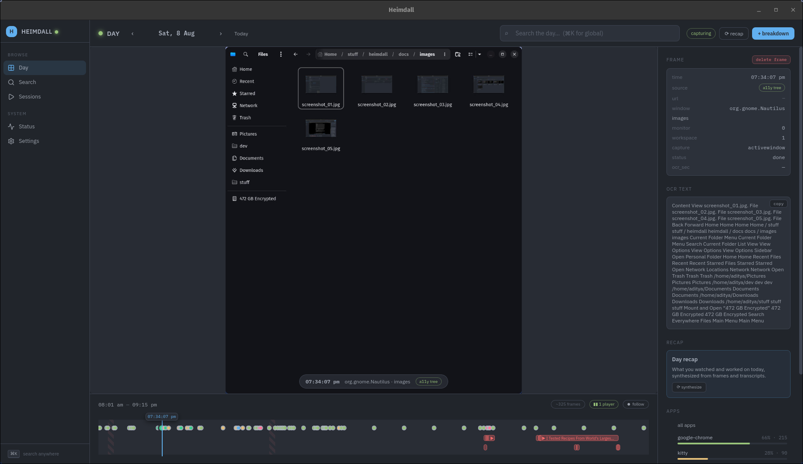
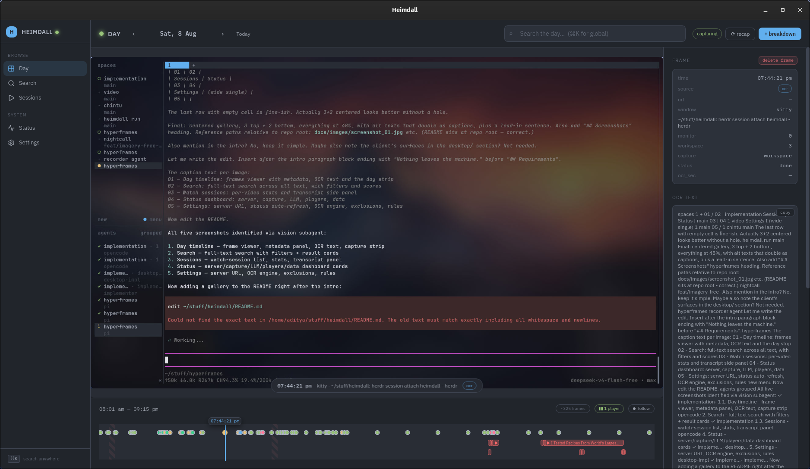

# heimdall

<p align="center">
  = 3.11"/>
  
  
  
  
</p>

> Made for myself, on my machine, against my habits. It is shaped around what
> *I* run (Hyprland, Chromium, VLC, sidra, an Intel Meteor Lake laptop with NPU)
> and the numbers below were all measured here. It is **not** a turnkey product:
> treat it as a reference build and feel free to fork, copy, and change anything
> to match your own setup — config, scripts, categories, cadence, all of it.

Local, screen-only memory for Hyprland. A capture daemon listens to Hyprland's
event socket and on window changes grim's the active-window region to JPEG and
reads the window's a11y tree (AT-SPI) into SQLite (FTS5 searchable). When a
window is blind (no a11y text) RapidOCR reads the pixels instead — via the NPU
(OpenVINO) when it's usable, else CPU; tesseract is retired. Music and video are
captured via MPRIS — video watch-sessions (VLC with exact file paths, Chromium
URLs resolved by a native-messaging extension) become first-class, searchable
memories. A FastAPI server (`127.0.0.1:3030`) serves search / frames /
watch-sessions / settings and runs two **pipes** — a day recap and a time
breakdown — through a local Gemma 4 QAT model on the Intel Arc Vulkan backend.
Nothing leaves the machine.

The UI is the **Tauri 2 desktop client** (`desktop/`): day timeline, search,
sessions, status and a settings surface that writes heimdall's own `config.yaml`
live — OCR engine, exclusions, window rules, scheduled pipes, pause, forget —
with no restart: the daemon and server hot-reload on a `settings.dirty` marker.

<p align="center">
  <picture>
    <source media="(prefers-color-scheme: dark)" srcset="docs/images/logo-white.png">
    
  </picture>
</p>

## Screenshots

<p align="center">
  
  
  <br/>
  
  
  <br/>
  
  
  <br/>
  
</p>

The old `screenshot_0X.jpg` names are gone — images live as `screenshot_1.png`
… `screenshot_7.png` in `docs/images/`.

## Measured numbers (mine, not yours)

> Disclaimer: everything below was measured on my hardware — Meteor Lake
> laptop, Intel Arc GPU on the Vulkan backend, Intel NPU via OpenVINO for
> RapidOCR, `gemma-4-E2B-it-qat-q4_0` on llama-server, `faster-whisper small`,
> `int8`. Timings and thresholds depended on Chromium's MPRIS behavior at the
> time; expect your numbers to differ.

- **Capture cadence**: `debounce_s: 1.5` (window change → capture), `min_interval_s: 10`,
  `keepalive_min: 5` base; the daemon publishes `capture.heartbeat` every 15s.
- **Watch polling**: the poll loop runs every `watch.poll_interval_s: 30`; a
  pause ends a session after `watch.pause_ends_session_s: 60`.
- **The bug that shaped sessions** (fixed): Chromium in a background tab
  throttles its MPRIS updates to ~one burst per ~30s. After a stretch of
  silence it emits two lines ~1s apart — the first a stale position, the second
  the caught-up one — and the pair differs on title/source. The tracker read
  that as a track switch and closed+reopened the session every cycle: a 26:20
  video became **30+ sessions**, each ~**1s of wall clock** wrapping ~**29s of
  video**, all `pos_end=0`. Three mechanisms were splitting sessions:
  1. metadata churn in the burst pair (tracker close-on-mismatch),
  2. a `Stopped` line (position 0) whenever the tab hides,
  3. Chromium deregistering its MPRIS instance while hidden (player-exit close).
- **What the fix does**: a title/source mismatch only closes when the position
  is NOT a real-time catch-up (no close if the position advanced at ≥1× wall);
  `stopped`-with-0 from Chromium becomes a *suspension* (session stays open,
  last position preserved); absence from `playerctl -l` never ends a Chromium
  session — it closes only when silence outlasts the pause threshold. Wall-time
  accrual for throttled reporters follows the video position advanced instead
  of the 1s line-to-line span.
- **Seek vs. playback**: a position jump counts as a seek only past
  `elapsed × 2 + 30s` (up to 2× playback speed + poll noise); ranges split
  there and the skipped video never counts as watched. Positions are µs, wall
  is ms; only *closed* segments are persisted, so open ranges never leak.
- **Desktop**: the Sessions tab polls the API every 15s (`FOLLOW_POLL_MS`) for
  live rows; the server URL lives in Settings (`DEFAULT_SERVER_URL` is
  `http://127.0.0.1:3931`, my device — the API itself binds 127.0.0.1:3030).
- **Pipes**: day recap at `0 23 * * *`, time breakdown at `5 23 * * *`; the
  breakdown merges the last N day-files deterministically (no extra LLM pass);
  one of 8 fixed categories per window class.

## Requirements

- Arch + Hyprland, `grim`, `playerctl`, `/usr/bin/llama-server`
- Vulkan GPU for the model (`-ngl 99`); see `scripts/start-llama.sh`
- `uv` for the dev/test toolchain
- Chromium/Electron must be launched accessibility-enabled (see Ops checklist)
- `yt-dlp` (pinned in the project venv) for YouTube caption transcripts
- `ffmpeg` for lazy ASR audio extraction; `faster-whisper` is optional (extra)
- NPU OCR (optional): an Intel NPU device + OpenVINO — without one, `auto`/`npu`
  engines fall back to CPU (the client shows an amber hint)
- Desktop client: Node + pnpm (+ Rust for `tauri build`)

## Install

```sh
uv sync                    # installs the CLI + core deps (yt-dlp captions + rapidocr/openvino OCR)
uv sync --extra asr        # + faster-whisper (lazy ASR for subtitle-less VLC files)
cd desktop && pnpm install # desktop client (Tauri 2)
```

Entry point: `heimdall` (CLI), `heimdall serve` (API + scheduler).

## Data layout

```
~/.heimdall/
  config.yaml            # tunables (see below) — the single source of truth
  data.db                # SQLite (WAL): frames, tracks, events, watch_sessions, *_fts
  capture.heartbeat      # ts written by the capture daemon (15s cadence)
  capture.engine         # active OCR engine (npu|cpu) published by the daemon
  capture.request/.ack   # manual-capture handshake (`heimdall capture` -> POST /capture)
  settings.dirty         # marker; touched on /settings writes, triggers hot-reload
  frames/YYYY/MM/DD/     # JPEGs, one per capture
  captions/              # cached caption content, keyed by media_id
  extensions/            # built native-messaging extension copy (install-messenger-host.sh)
  output/                # day-recap-*.md, time-breakdown-*.md
  logs/                  # optional, if you pass --log-dir
```

## Config (`~/.heimdall/config.yaml`, tunables only)

```yaml
data_dir: ~/.heimdall
api: {bind: 127.0.0.1, port: 3030}
llama_server: {base_url: http://127.0.0.1:8080, model: gemma-4-E2B-it-qat-q4_0}
capture: {debounce_s: 1.5, min_interval_s: 10, keepalive_min: 5, extract_workers: 1,
          extraction: auto, change_gate: true, window_class_merge: {},
          ocr_engine: auto, paused: false}
asr: {model: small, device: cpu, compute_type: int8}
watch: {pause_ends_session_s: 60, poll_interval_s: 30, media_resolver: extension,
        excluded_players: [sidra], excluded_windows: []}
scheduler: {day_recap: "0 23 * * *", time_breakdown: "5 23 * * *"}
rules: {window_class_category: {sidra: Music, mpv: Movies}}
observability: {enabled: true}
```

Missing file/keys → code defaults. Langfuse keys are env-only (`LANGFUSE_*`).
Observability defaults to **enabled**, but stays a no-op until the `langfuse`
package is installed and `LANGFUSE_HOST`/`LANGFUSE_PUBLIC_KEY`/`LANGFUSE_SECRET_KEY`
are set — capture/OCR are never traced, only pipe runs.

### Live settings (the spine)

`GET /settings` returns the full writable surface (12 keys) read live from
config.yaml; `POST /settings {key, value}` writes one key through to the file
(unknown keys preserved, atomic write) and touches `settings.dirty`. The capture
daemon (15s poll) and the server re-read config live:

- `capture.ocr_engine` — `auto` (NPU when usable, else CPU) | `npu` | `cpu`;
  `/status` reports `capture.ocr_engine {configured, active}` so a fallback is
  visible (amber hint in the client)
- `capture.extraction` — `auto` (a11y text, else OCR) | `a11y` only | `ocr` only
- `capture.paused` — full-stop pause: no frames, extraction, watch sessions or ASR
- `capture.change_gate` — per-window phash gate: unchanged keepalives are stored
  but not re-extracted
- `capture.window_class_merge` — `{window_class: ocr_also}`: classes that always
  store OCR text alongside a11y text
- `watch.excluded_players` / `watch.excluded_windows` — MPRIS players and window
  classes that never produce frames/sessions (scheduled captures only — manual
  captures bypass the gate)
- `watch.media_resolver` — `extension` (default) | `cdp` for Chromium URLs
- `scheduler.day_recap` / `scheduler.time_breakdown` — cron, or **null = pipe
  disabled**; edits re-arm the job live (`/status` shows next runs)
- `observability.enabled` — tracing toggle, applied live
- `rules.window_class_category` — window class → one of the 8 fixed breakdown
  categories

`POST /forget {categories, start, end}` hard-deletes frames / sessions /
transcripts in a time window in one transaction (FTS stays consistent via AFTER
DELETE triggers; frame images and caption-cache files follow after commit).

## Design decisions (why it's shaped this way)

- **Screen-first, not clipboard/audio**: memory of what I *looked* at, in a
  window — a11y text is cheap and exact, OCR only for blind windows, and the
  phash change-gate skips re-extraction of unchanged keepalives.
- **MPRIS is the watch-source of truth, not screen recording**: sessions are
  (player, title, source) state machines with µs positions; ranges only
  accumulate closed segments, seeks split them, rewinds never count, positions
  clamp to the known length. The Chromium burst quirks above are handled at the
  tracker level so the DB never sees fabricated fragments.
- **Plain scripts, no systemd**: four `exec-once` lines in `hyprland.conf` (or
  nothing — autostart is OFF by default); logs are stdout/stderr or
  `--log-dir`. This is intentional: nothing to debug in a service manager, and
  a crash gaps data visibly in the UI.
- **API-only backend**: no HTML UI; the desktop client is a pure HTTP client
  over a loopback-only server, so any HTTP client (or `curl`) can drive it.
- **Settings as the spine**: a small writable surface (12 keys) that hot-reloads
  without restarts, because capture/sessions/scheduler settings are meant to be
  fiddled live while watching the effect.
- **Deterministic pipes**: recap/breakdown output is idempotent and merges
  deterministically (no LLM for the multi-day merge) so reruns never mutate
  history.
- **Local-or-bust**: NPU OCR when the hardware exists, local Gemma otherwise;
  captions via `yt-dlp`, ASR only when there is no caption track. Nothing
  leaves the machine (observability is off unless keys are set).

## Run (plain scripts — no systemd)

```sh
scripts/start-llama.sh                    # model server, Vulkan, foreground
scripts/start-capture.sh --log-dir ~/.heimdall/logs   # capture daemon
heimdall serve                            # API + scheduler (23:00/23:05 pipes)
heimdall status                           # down-detector
cd desktop && pnpm tauri dev              # desktop client (the UI)
```

The API is loopback-only and **API-only** — there is no HTML UI; the desktop
client is a pure HTTP client with the server URL in Settings
(dev: `pnpm tauri dev`, prod bundle: `pnpm tauri build`).

Autostart is opt-in (default OFF) — one `exec-once` per piece in `hyprland.conf`:

```
exec-once = ~/stuff/heimdall/scripts/start-llama.sh > ~/.heimdall/logs/llama.log 2>&1
exec-once = ~/stuff/heimdall/scripts/start-capture.sh --log-dir ~/.heimdall/logs
exec-once = uv run heimdall serve > ~/.heimdall/logs/serve.log 2>&1
```

(my checkout lives at `~/stuff/heimdall` — adjust the paths to your clone)

A crashed capture gaps data until noticed; scheduled pipes only run while
`serve` is up. Logs are per-terminal stdout/stderr or `~/.heimdall/logs/`.

## Ops checklist (launch prerequisites & installs)

Run once after setup; everything is a plain script, no service manager.

- [ ] **Chromium/Electron accessibility (a11y capture)**: launch the browser with
  `ACCESSIBILITY_ENABLED=1` and `--force-renderer-accessibility`, e.g.
  `exec-once = env ACCESSIBILITY_ENABLED=1 chromium --force-renderer-accessibility`
  (add the flag to your launcher's Exec line for other apps). Without it the a11y
  tree is empty and the window falls back to OCR.
- [ ] **Chromium URL resolution**: run `scripts/install-messenger-host.sh`, then
  load the built extension from `~/.heimdall/extensions/heimdall-messenger` via
  `chrome://extensions` (Developer mode → Load unpacked). No debug port needed.
  Only the legacy `watch.media_resolver: cdp` path requires Chrome started with
  `--remote-debugging-port`.
- [ ] **NPU OCR (optional)**: install the Intel NPU driver; `uv sync` already
  brings `openvino`. Without an NPU device, `auto`/`npu` fall back to CPU —
  visible via `heimdall status --json` → `capture.ocr_engine.active` and the
  client's amber hint.
- [ ] **yt-dlp venv**: captions need `yt-dlp` (pinned in the project venv via
  `uv sync`). Verify with `uv run python -c "import yt_dlp"`.
- [ ] **faster-whisper (optional)**: needed only when local-file (VLC) sessions
  have no caption track — `uv sync --extra asr`, then the `small` model downloads
  on first use. Without it, ASR jobs report unavailable and sessions stay
  title-only.
- [ ] **ffmpeg**: required for lazy ASR (anywhere on `PATH`).
- [ ] **Autostart**: opt-in, OFF by default — add the `exec-once` lines above
  only if you want capture + pipes at login.

## CLI

```sh
heimdall search <q> [--kind --window-class --player --start --end --limit --offset --json]
heimdall sessions [--player --start --end --limit --offset --json]
heimdall recap [today|yesterday|YYYY-MM-DD]
heimdall breakdown [day] [--days N] [--json]
heimdall status [--json]
heimdall capture [--json]
heimdall run <pipe> [--day today]
heimdall serve
```

Every command accepts the global `--config <path>` flag (default
`~/.heimdall/config.yaml`); `--json` prints raw JSON output.

`breakdown --days N` merges the last N day-files deterministically (no extra
LLM pass) into `output/time-breakdown-{endday}-{N}d.md`.

## Tests

```sh
uv run pytest tests/ -q        # backend
cd desktop && pnpm test        # desktop client (Vitest + RTL, MSW)
```

Seams tested (backend): HTTP API (FTS search/ranking, frames, pipes,
watch-sessions, settings + forget), pipe parse/render + deterministic merge,
capture event/span math, the MPRIS watch-session state machine (including the
Chromium throttled-burst regressions), the live settings spine. The real
llama-server/Vulkan path and OCR accuracy are verified via the checklist above,
not unit tests.

## How this project gets built (spec-driven development)

Heimdall is developed spec-first: every workstream starts as a **wayfinder map**
issue — a decision map of tickets that get resolved one at a time until the way
is clear — then research/grilling tickets lock acceptance contracts, prototypes
de-risk seams, and the final spec is implemented against. The current map for
the media-capture side (watch-sessions, the extension URL contract, and the
Chromium MPRIS quirks documented above) is:

**[Map: media capture v3 — trustworthy MPRIS sessions, extension URLs, YouTube-only subtitles](https://github.com/adityanandanx/heimdall/issues/78)**

and the other maps track the rest of the lifecycle: the screen-content pipeline
([Map: Heimdall v2 — screen-content pipeline](https://github.com/adityanandanx/heimdall/issues/13)),
the NPU OCR engine ([Map: NPU engine](https://github.com/adityanandanx/heimdall/issues/65)),
and the desktop client ([Map: Heimdall desktop client — Tauri v1](https://github.com/adityanandanx/heimdall/issues/21)).
Reading a map plus its resolved tickets shows *why* a subsystem looks the way it
does — faster and cheaper than archaeology.

Again: this all reflects my context. If you adopt any of it, expect to re-measure
the numbers and re-decide the decisions for your own machine.